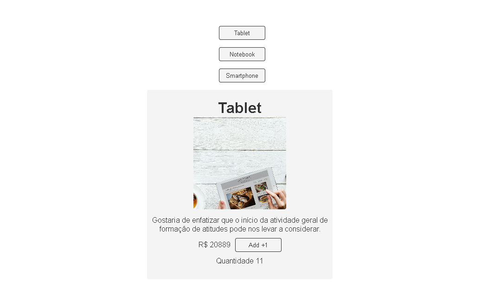

# useState-Exercicio
Criado com o editor Web SandBox

  Esse exercício foi desenvolvido com o intuito de estudar e praticar useStates no ReactJs.

## Aprendizado

Aprendi a consumir Apis com o useStates, com isso notei a facilidade de usar propriedades e puxar os 
dados da api para outros componentes.

## Tecnologias utilizada
- ReactJs
- useStates(Hooks)
- Fetch Apis

## Exercício

// O link abaixo puxa dados de um produto em formato JSON

https://ranekapi.origamid.dev/json/api/produto/

// Crie uma interface com 3 botões, um para cada produto.

// Ao clicar no botão faça um fetch a api e mostre os dados do produto na tela.

// Mostre apenas um produto por vez

// Mostre a mensagem carregando... enquanto o fetch é realizado

